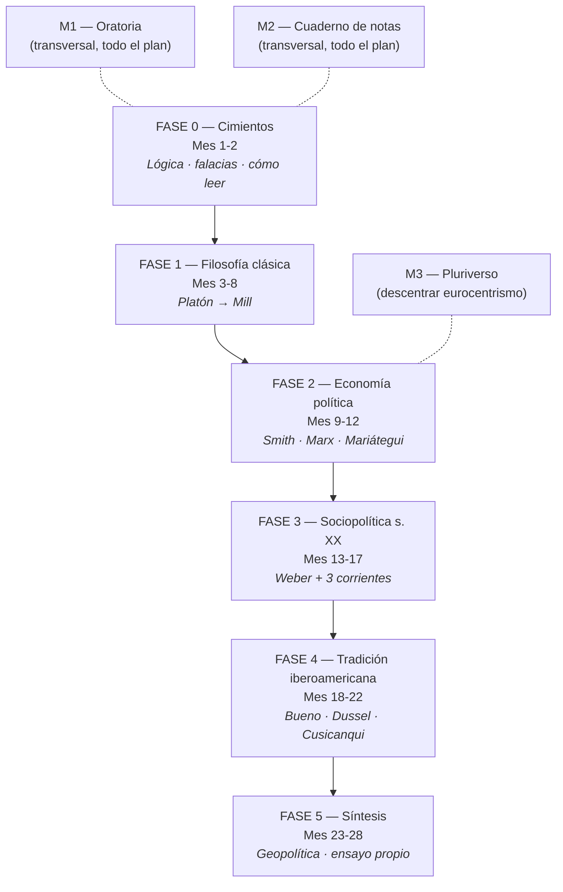

# Empieza aquí

¿Primera vez? Esta página te lleva paso a paso desde *"nunca abrí un libro de filosofía"* hasta *"tengo un ritual diario sostenible"*.

**Tiempo de lectura:** 7 min. **Tiempo del Día 1 que verás abajo:** 30 min.

---

## ¿Qué es este curso?

Un **itinerario personal de formación** en filosofía política, sociopolítica, economía y pensamiento crítico. No es una carrera universitaria — es la dieta intelectual de alguien que quiere **saber de lo que habla** sin pretensión académica.

- **Duración:** 27-29 meses a un ritmo de **3-5 h/semana**. Ajustable.
- **Lecturas:** ~25 libros (algunos completos, otros en selección), más vídeos, podcasts y dos cursos universitarios abiertos (Yale, Harvard).
- **Coste:** prácticamente cero. Casi todas las lecturas tienen versión gratuita online (ver enlaces más abajo).
- **Modalidad:** autodidacta con verificación pedagógica (cuaderno de notas + autoevaluación Bloom 1-6 + manual de falacias para entrenar pensamiento crítico).

## ¿Para quién es?

Para ti si reconoces algo de esto:

- Te gusta opinar de política pero te falta base.
- Quieres pasar de consumir contenidos en YouTube a leer **obras primarias** con criterio.
- Quieres formar tu propio criterio sin "comprar" un paquete ideológico cerrado.
- Quieres aprender a **detectar falacias** en debates reales en tiempo real.
- Quieres **escribir y hablar** con más precisión sobre temas socio-políticos.

## El mapa del curso

5 fases secuenciales + 3 módulos transversales (paralelos).

Cada fase tiene **objetivos de salida** (lo que sabrás al terminar) y **lecturas obligatorias + opcionales**. Si una semana no puedes con todo, **mantén el ritual diario de 10 min** y suspende el resto. La constancia gana a la intensidad.

## Cómo usar este sitio (tour)

| Sección | Para qué sirve | Cuándo usarla |
|---------|----------------|---------------|
| **[Inicio](index.md)** | Dashboard con reloj, fase actual, tiempo de estudio, racha | Cada vez que abres el sitio |
| **[Plan → Maestro](plan/maestro.md)** | La biblia: las 5 fases con todos los libros y recursos | Para planear cada fase |
| **[Plan → Cómo ejecutar](plan/ejecutar.md)** | Cadencia diaria/semanal + escala Bloom 1-6 | Para resolver "¿cómo organizo mi semana?" |
| **[Plan → Falacias](plan/falacias.md)** | Manual de detección + protocolo de práctica | A partir del día 1, todos los días |
| **[Progreso](seguimiento.md)** | Checklist por fase + autoevaluación trimestral | Una vez al mes para marcar y reflexionar |
| **[Lecturas](lecturas/index.md)** | Tus notas, una por libro completado | Al terminar cada libro |
| **[Plantillas](plantillas/index.md)** | Descargas: nota de lectura, ensayo, log de falacias | Para empezar archivos nuevos |

## Día 1 — qué hacer HOY (30 min)

No esperes al lunes ideal. Hazlo hoy aunque sean 20 min mal hechos. Romper la inercia es lo único que importa hoy.

!!! tip "Checklist del Día 1"
    1. **Configurar tu fecha de inicio** en la [página de inicio](index.md) (botón "guardar"). Sin esto el dashboard no calcula nada. [2 min]
    2. **Ver los primeros 10 min** de la clase 1 de Yale, *"What Is Political Philosophy?"* (Steven Smith) — abajo. [10 min]
    3. **Empezar** Mortimer Adler, *Cómo leer un libro*, prólogo + cap. 1 (descarga en archive.org o consigue una copia). [10 min]
    4. **Capturar tu primera falacia** en el [formulario web](plantillas/plantilla-falacia.md) — la primera que veas hoy en redes, prensa o TV. [3 min]
    5. **Marcar 30 min** en el contador de tiempo del [dashboard](index.md). [10 seg]

### Embebido: Yale PLSC 114 — Clase 1 ("What Is Political Philosophy?")

<iframe src="https://www.youtube.com/embed/xhm55mIdSuk?rel=0" style="position: absolute; top: 0; left: 0; width: 100%; height: 100%; border: 0;" title="Yale PLSC 114 Lecture 1 - What Is Political Philosophy?" allow="accelerometer; autoplay; clipboard-write; encrypted-media; gyroscope; picture-in-picture" allowfullscreen></iframe>

[:material-open-in-new: Playlist completa de las 24 clases (gratis, Yale)](https://www.youtube.com/playlist?list=PL8D95DEA9B7DFE825){ .md-button .md-button--primary target="_blank" rel="noopener" }
[:material-school: Página oficial Open Yale Courses](https://oyc.yale.edu/political-science/plsc-114){ .md-button target="_blank" rel="noopener" }

---

## Semana 1 — horario tipo

Adáptalo a tu vida. Lo importante es la regularidad, no el bloque exacto.

| Día | Tarea (15-25 min) | Bloque pesado (60-90 min) |
|-----|--------------------|--------------------------|
| **Lunes** | Ritual diario + capturar falacia del día | — |
| **Martes** | Ritual diario + capturar falacia | — |
| **Miércoles** | Ritual diario + capturar falacia | — |
| **Jueves** | Ritual diario + capturar falacia | — |
| **Viernes** | Ritual diario + capturar falacia | — |
| **Sábado** | Ritual diario | Clase Yale 1 + ficha en `lecturas/` |
| **Domingo** | Repasar tus 5-7 falacias capturadas | Reflexión: ¿qué patrón veo? |

**Ritual diario (15-25 min)** =
- 5 min — lectura en voz alta del libro de la fase.
- 10-15 min — lectura activa (subrayar, anotar al margen).
- 3-5 min — capturar 1 falacia del día.

## Construir el hábito (lo único que importa)

Investigación robusta sobre formación de hábitos (BJ Fogg, James Clear) coincide en tres reglas:

1. **Mismo momento del día siempre.** Si lo dejas para "cuando pueda", no lo harás. Eso sí — la HORA exacta la eliges tú. *Después del café del desayuno*, *antes de dormir*, *en el bus de vuelta a casa*.
2. **Anclaje a un hábito existente.** "Después de servirme el café, leo 10 min." El café ya existe; lo nuevo se pega a lo viejo.
3. **Reduce la fricción del Día 0.** Deja el libro abierto la noche antes en la página donde te quedaste. Deja el navegador abierto en este sitio.

**Si pierdes un día:** no lo dramatices. **Vuelves al ritual al día siguiente.** Lo único que rompe el plan es perder 3-4 semanas seguidas porque tras la primera te castigas y abandonas.

## Recursos gratuitos imprescindibles (para empezar HOY)

### Cursos universitarios abiertos (vídeo, gratis)

- **[Yale PLSC 114 — Introduction to Political Philosophy](https://oyc.yale.edu/political-science/plsc-114)** (Steven Smith). 24 clases. Tu columna de Fase 1.
- **[Harvard — *Justice*](https://www.edx.org/learn/justice/harvard-university-justice)** (Michael Sandel). 12 clases también en [YouTube](https://www.youtube.com/playlist?list=PL30C13C91CFFEFEA6).
- **[David Harvey — Reading Marx's *Capital*](https://davidharvey.org/reading-capital/)**. El mejor companion video al *Capital* de Marx, gratis.

### Bibliotecas digitales (PDFs gratuitos legales)

- **[marxists.org](https://www.marxists.org/espanol/)** — biblioteca completa en español: Marx, Lenin, Mariátegui, Gramsci, Fanon, Rosa Luxemburgo.
- **[Project Gutenberg](https://www.gutenberg.org/)** — clásicos en dominio público: Platón, Aristóteles, Maquiavelo, Hobbes, Locke, Mill, Rousseau.
- **[Biblioteca Cervantes Virtual](https://www.cervantesvirtual.com/)** — clásicos en español. Bolívar, Martí, González Prada.
- **[fgbueno.es](https://www.fgbueno.es/)** — obra completa de Gustavo Bueno (vídeos + textos).
- **[CLACSO Biblioteca Virtual](https://biblioteca-repositorio.clacso.edu.ar/)** — 200.000+ textos gratuitos de ciencias sociales latinoamericanas.
- **[Internet Archive](https://archive.org/)** — escaneos de casi cualquier libro académico.

### Diccionario y referencias

- **[Stanford Encyclopedia of Philosophy](https://plato.stanford.edu/)** — la referencia mundial sobre cualquier concepto filosófico. Cuando algo no entiendas, ve aquí antes que a Wikipedia.

### Canales YouTube en español

- **[La Fonda Filosófica](https://www.youtube.com/@LaFondaFilosófica)** — divulgación filosófica de alta calidad.
- **[Santiago Armesilla](https://www.youtube.com/@SantiagoArmesilla)** — la voz que te trajo al plan. Materialismo filosófico + geopolítica.
- **[Roberto Augusto](https://www.youtube.com/@robertoaugustoaprende-fil9081)** — filosofía de Gustavo Bueno explicada con claridad.
- **[Juan Ramón Rallo](https://www.youtube.com/@JuanRamonRallo)** — el lado liberal-austríaco. Para conocer al adversario y debatir.
- **[Quantum Fracture](https://www.youtube.com/@QuantumFracture)** — vídeos cortos sobre lógica y falacias (entre otros temas).

## :material-clipboard-question: Diagnóstico de entrada (opcional)

**Adición tras revisión pedagógica:** alguien que ya leyó *El Príncipe* y *El Capital* no debería empezar Fase 0 igual que alguien que jamás abrió filosofía. Responde estas 12 preguntas honestamente para auto-ubicarte.

??? question "1. ¿Puedes definir 'falacia lógica' y dar 3 ejemplos concretos?"
    **Si NO:** empieza en Fase 0 (Schopenhauer + manual de falacias).
    **Si SÍ:** salta Fase 0 directo a Fase 1, manteniendo el log de falacias diario.

??? question "2. ¿Has leído al menos un libro entero de filosofía política antes? (no resumen, no Wikipedia — el libro)"
    **Si NO:** Fase 1 es para ti — empieza por Adler en Fase 0.
    **Si SÍ — uno o dos:** Fase 1 sigue siendo para ti.
    **Si SÍ — varios (>3):** ve a la pregunta 3.

??? question "3. ¿Puedes distinguir Hobbes / Locke / Rousseau sin caricaturizar a ninguno?"
    **Si NO:** Fase 1 obligatoria.
    **Si SÍ:** salta Fase 1 a evaluación (responde sus 6 preguntas de retención sin consultar). Si fallas 2+, vuelves. Si pasas, vas a Fase 2.

??? question "4. ¿Sabes qué es la plusvalía y puedes aplicarla a un caso concreto?"
    **Si NO:** Fase 2 obligatoria, sin atajos.
    **Si SÍ:** Fase 2 puede ser relectura crítica, no descubrimiento.

??? question "5. ¿Puedes nombrar las 4 grandes escuelas económicas (clásica, neoclásica, keynesiana, marxista)?"
    **Si NO:** Fase 2 te desbloquea esto.

??? question "6. ¿Sabes quién es Weber y qué es 'monopolio de la violencia legítima'?"
    **Si NO:** Fase 3 imprescindible.

??? question "7. ¿Puedes explicar 'hegemonía' (Gramsci) o 'biopolítica' (Foucault)?"
    **Si SÍ a ambos:** sólido en teoría política contemporánea.

??? question "8. ¿Sabes quiénes son Crenshaw / Patricia Hill Collins y qué es interseccionalidad?"
    **Si NO:** la corriente transversal feminista de Fase 3 es para ti.

??? question "9. ¿Has oído de Gustavo Bueno y el Materialismo Filosófico?"
    **Si SÍ:** Fase 4 te servirá pero ya tienes ventaja.

??? question "10. ¿Conoces a Aníbal Quijano, Enrique Dussel o Silvia Rivera Cusicanqui?"
    **Si SÍ a alguno:** el bloque decolonial de Fase 4 te aportará el resto.

??? question "11. ¿Has escrito un ensayo de 1500+ palabras citando 3+ filósofos políticos?"
    **Si NO:** la práctica de escritura de Fase 5 es crítica. No la subestimes.

??? question "12. ¿Tienes ahora mismo un ritual diario establecido (cualquiera, no necesariamente de estudio)?"
    **Si SÍ:** engancha el plan a ese ritual.
    **Si NO:** empieza por construir el ritual mínimo de 10 min ANTES de comprar un solo libro.

### Cómo interpretar tus respuestas

- **0-3 SÍ:** empieza en Fase 0 sin atajos. Es tu plan completo (28 meses).
- **4-7 SÍ:** Fase 0 abreviada (2-3 semanas). Acelera.
- **8-11 SÍ:** salta Fase 0, evalúa Fase 1 respondiendo sus 6 preguntas. Si pasas, empiezas en Fase 2.
- **12 SÍ:** este plan no es tu nivel. Necesitas algo más avanzado (literatura secundaria, doctorado).

---

## FAQ corta

??? question "¿Qué hago si esta semana no me da tiempo?"
    Mantén solo el **ritual diario de 10 min** y suspende lo demás. Si tampoco puedes con eso, fija un día concreto para retomar (sábado, próximo lunes) y déjalo apuntado. La cancelación con fecha de retorno NO rompe el plan; el silencio indefinido sí.

??? question "Leo pero no me entero de nada"
    Tres causas y arreglos:

    1. **Falta contexto histórico** → antes de la obra primaria, ve la clase de Yale o lee la entrada relevante en [Stanford Encyclopedia of Philosophy](https://plato.stanford.edu/).
    2. **Vas demasiado rápido** → reduce a 5 páginas/hora. Filosofía bien leída es lenta. No te asustes.
    3. **El libro no es para tu nivel** → cambia por una versión introductoria. Jonathan Wolff, *An Introduction to Political Philosophy*, es el libro-puerta estándar.

??? question "¿Puedo saltar fases?"
    Puedes pero pierdes mucho. Las fases están en orden por una razón: cada una asume conceptos de la anterior. *El Capital* de Marx tiene mucho más sentido **después** de Adam Smith. La obra de Bueno tiene más sentido **después** de saber qué es el materialismo histórico de Marx. El plan ya está calibrado para que cada paso lo prepare el anterior.

??? question "¿Y si me obsesiono con un autor?"
    Te lo permites por 1 mes. Pero al mes 2 vuelve al pluralismo. **La obsesión sin contraste es el camino al dogmatismo**, justo lo opuesto al objetivo del plan. El plan está diseñado para que conozcas a Marx **y** a Hayek, a Bueno **y** a Dussel, a Schmitt **y** a hooks. Esa fricción es lo que produce criterio.

??? question "¿Cuándo sé si estoy avanzando de verdad?"
    No por las páginas leídas, sino por las señales de verificación del [plan maestro](plan/maestro.md):

    - **Mes 3:** detectas falacias en debate de TV en tiempo real.
    - **Mes 6:** explicas en 5 min la diferencia entre liberalismo clásico y neoliberalismo.
    - **Mes 12:** sostienes 30 min de conversación sobre marxismo o Bueno.
    - **Mes 18:** identificas la tradición intelectual de un columnista sin que la confiese.
    - **Mes 24:** ensayo propio de 1500+ palabras del que no te avergüenzas.

    Si en 3 meses no llegas al punto 1, **no aceleres** — revisa la Fase 0. La base sostiene todo lo demás.

---

## Ahora sí

Cierra esta pestaña, abre [el dashboard](index.md), pon tu fecha de inicio. **Hoy.**
