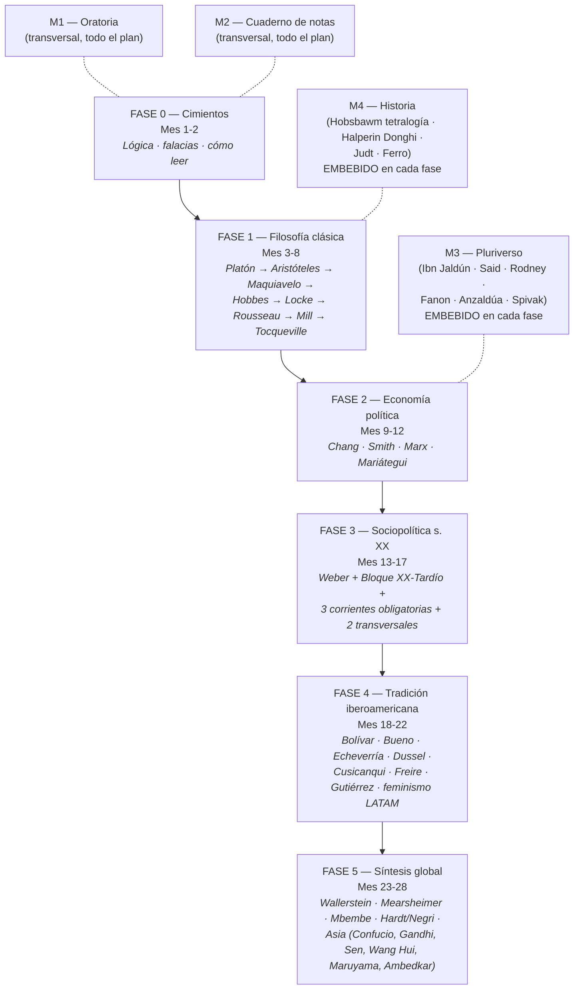

# Empieza Aquí

¿Primera vez? Esta página te lleva paso a paso desde *"nunca abrí un libro de filosofía"* hasta *"tengo un ritual diario sostenible"*.

**Tiempo de lectura:** 10 min. **Tiempo del Día 1 que verás abajo:** 30 min.

---

## ¿Qué es este curso?

Un **itinerario personal de formación** en filosofía política, sociopolítica, economía y pensamiento crítico. No es una carrera universitaria — es la dieta intelectual de alguien que quiere **saber de lo que habla** sin pretensión académica.

- **Duración:** 27-29 meses a un ritmo de **3-5 h/semana** (con picos de 6-8 h en Fase 3). Ajustable.
- **Lecturas:** **~70 autores** entre fases y módulos transversales, mezclando obras primarias completas, selecciones de capítulos y papers fundacionales.
- **Coste:** prácticamente cero. ~70% de las lecturas tienen versión gratuita legal online; el resto se consigue en biblioteca pública o por ~100-150 € si lo compras todo.
- **Modalidad:** autodidacta con verificación pedagógica:
    - **Cuaderno de notas** (M2)
    - **Manual de falacias** para entrenar pensamiento crítico
    - **Autoevaluación Bloom 1-6** con [rúbricas calibradas](plan/bloom-rubricas.md)
    - **Puntos de naufragio** anticipados con protocolos de rescate
    - **Salidas honorables** si no terminas — cada fase parcial vale

## ¿Para quién es?

Para ti si reconoces algo de esto:

- Te gusta opinar de política pero te falta base.
- Quieres pasar de consumir contenidos en YouTube a leer **obras primarias** con criterio.
- Quieres formar tu propio criterio sin "comprar" un paquete ideológico cerrado.
- Quieres aprender a **detectar falacias** en debates reales en tiempo real.
- Quieres **escribir y hablar** con más precisión sobre temas socio-políticos.

## El mapa del curso

Los módulos transversales **M3 (Pluriverso)** y **M4 (Historia)** ya NO son separados — están **embebidos en cada fase con una tabla mes a mes** que te dice qué leer en paralelo. Mira al final de cada fase la sección "Lecturas paralelas integradas (M3 + M4)".

## Cómo usar este sitio (tour)

| Sección | Para qué sirve | Cuándo usarla |
|---------|----------------|---------------|
| **[Inicio](index.md)** | Dashboard con reloj, fase actual, tiempo de estudio, racha | Cada vez que abres el sitio |
| **[Plan → Maestro](plan/maestro.md)** | Visión general de las 5 fases | Para entender el plan completo |
| **[Plan → Fase 0 a 5](plan/fase-0.md)** | Páginas por fase con tarjetas profundas por autor + lecturas paralelas integradas (M3 + M4) | Cuando empiezas cada fase |
| **[Plan → Módulo Historia](plan/historia.md)** | Visión general del módulo M4 | Como referencia |
| **[Plan → Pluriverso autores](plan/pluriverso-autores.md)** | Tarjetas profundas M3 (Ibn Jaldún, Rodney, Said, Fanon, Anzaldúa, Spivak) | Cuando llegues a la lectura paralela correspondiente |
| **[Plan → Historia autores](plan/historia-autores.md)** | Tarjetas profundas M4 (Hobsbawm tetralogía, Halperin, Judt, Ferro) | Cuando llegues a la lectura paralela correspondiente |
| **[Plan → Cómo ejecutar](plan/ejecutar.md)** | Cadencia diaria/semanal + escala Bloom 1-6 | Para resolver "¿cómo organizo mi semana?" |
| **[Plan → Falacias](plan/falacias.md)** | Manual + protocolo de práctica | Desde el día 1 |
| **[Plan → Rúbricas Bloom](plan/bloom-rubricas.md)** | Ejemplos calibrados de N2 a N6 | Para autoevaluarte honestamente |
| **[Plan → Puntos de naufragio](plan/naufragios.md)** | 7 puntos donde se cae la gente + protocolos | Antes de cada bloque complicado |
| **[Plan → Salidas honorables](plan/salidas-honorables.md)** | Qué ganaste si no terminas | Si dudas, recuerda que terminar es opcional |
| **[Plan → Mapa de conexiones](plan/conexiones.md)** | Líneas verticales y debates horizontales entre autores | Para construir las conexiones que el plan pide |
| **[Bibliografía](bibliografia.md)** | Tabla completa con los 70+ libros del plan | Para planear compras o consultas en biblioteca |
| **[Progreso](seguimiento.md)** | Checklist por fase + autoevaluación trimestral | Una vez al mes para marcar y reflexionar |
| **[Lecturas](lecturas/index.md)** | Tus notas, una por libro completado | Al terminar cada libro |
| **[Plantillas](plantillas/index.md)** | Descargas | Para empezar archivos nuevos |
| **[Actualidad](actualidad.md)** | Titulares automatizados de Elcano + BBC + El País + The Conversation | Cuando quieras conectar el plan con la actualidad |

## Día 1 — qué hacer HOY (30 min)

No esperes al lunes ideal. Hazlo hoy aunque sean 20 min mal hechos. Romper la inercia es lo único que importa hoy.

!!! tip "Checklist del Día 1"
    1. **Configurar tu fecha de inicio** en la [página de inicio](index.md). [2 min]
    2. **Ver los primeros 10 min** de la clase 1 de Yale, *"What Is Political Philosophy?"* — abajo. [10 min]
    3. **Empezar** Mortimer Adler, *Cómo leer un libro*, prólogo + cap. 1. [10 min]
    4. **Capturar tu primera falacia** en el [formulario web](plantillas/plantilla-falacia.md). [3 min]
    5. **Marcar 30 min** en el contador de tiempo del [dashboard](index.md). [10 seg]

### Embebido: Yale PLSC 114 — Clase 1 ("What Is Political Philosophy?")

<iframe src="https://www.youtube.com/embed/xhm55mIdSuk?rel=0" style="position: absolute; top: 0; left: 0; width: 100%; height: 100%; border: 0;" title="Yale PLSC 114 Lecture 1 - What Is Political Philosophy?" allow="accelerometer; autoplay; clipboard-write; encrypted-media; gyroscope; picture-in-picture" allowfullscreen></iframe>

[:material-open-in-new: Playlist completa de las 24 clases (gratis, Yale)](https://www.youtube.com/playlist?list=PL8D95DEA9B7DFE825){ .md-button .md-button--primary target="_blank" rel="noopener" }
[:material-school: Página oficial Open Yale Courses](https://oyc.yale.edu/political-science/plsc-114){ .md-button target="_blank" rel="noopener" }

---

## Semana 1 — horario tipo

| Día | Tarea (15-25 min) | Bloque pesado (60-90 min) |
|-----|--------------------|--------------------------|
| **Lunes** | Ritual diario + capturar falacia del día | — |
| **Martes** | Ritual diario + capturar falacia | — |
| **Miércoles** | Ritual diario + capturar falacia | — |
| **Jueves** | Ritual diario + capturar falacia | — |
| **Viernes** | Ritual diario + capturar falacia | — |
| **Sábado** | Ritual diario | Clase Yale 1 + ficha en `lecturas/` |
| **Domingo** | Repasar tus 5-7 falacias capturadas | Reflexión: ¿qué patrón veo? |

## Construir el hábito (lo único que importa)

1. **Mismo momento del día siempre.** Si lo dejas para "cuando pueda", no lo harás.
2. **Anclaje a un hábito existente.** "Después de servirme el café, leo 10 min."
3. **Reduce la fricción del Día 0.** Deja el libro abierto la noche antes en la página donde te quedaste.

**Si pierdes un día:** no lo dramatices. Vuelves al ritual al día siguiente.

## Recursos gratuitos imprescindibles

### Cursos universitarios abiertos (vídeo, gratis)

- **[Yale PLSC 114 — Introduction to Political Philosophy](https://oyc.yale.edu/political-science/plsc-114)** (Steven Smith). 24 clases. Tu columna de Fase 1.
- **[Harvard — *Justice*](https://www.edx.org/learn/justice/harvard-university-justice)** (Michael Sandel). 12 clases también en [YouTube](https://www.youtube.com/playlist?list=PL30C13C91CFFEFEA6).
- **[David Harvey — Reading Marx's *Capital*](https://davidharvey.org/reading-capital/)**. El mejor companion video al *Capital* de Marx, gratis.
- **[Yale HIST 202 — European Civilization 1648-1945](https://oyc.yale.edu/history/hist-202)** (John Merriman). Columna del Módulo M4.

### Bibliotecas digitales (PDFs gratuitos legales)

- **[marxists.org](https://www.marxists.org/espanol/)** — Marx, Lenin, Mariátegui, Gramsci, Fanon, Davis.
- **[Project Gutenberg](https://www.gutenberg.org/)** — clásicos en dominio público.
- **[Biblioteca Cervantes Virtual](https://www.cervantesvirtual.com/)** — clásicos en español.
- **[fgbueno.es](https://www.fgbueno.es/)** — obra de Gustavo Bueno (vídeos + textos).
- **[CLACSO Biblioteca Virtual](https://biblioteca-repositorio.clacso.edu.ar/)** — 200.000+ textos gratuitos.
- **[Internet Archive](https://archive.org/)** — préstamo digital de casi cualquier libro académico.

### Diccionario y referencias

- **[Stanford Encyclopedia of Philosophy](https://plato.stanford.edu/)** — la referencia mundial.

## Diagnóstico de entrada (opcional)

Alguien que ya leyó *El Príncipe* y *El Capital* NO debería empezar Fase 0 igual que alguien que jamás abrió filosofía. Responde estas 12 preguntas para auto-ubicarte.

??? question "1. ¿Puedes definir 'falacia lógica' y dar 3 ejemplos concretos?"
    **NO:** empieza en Fase 0. **SÍ:** salta a Fase 1, manteniendo el log de falacias.

??? question "2. ¿Has leído al menos un libro entero de filosofía política antes?"
    **NO:** Fase 1 obligatoria desde Adler. **Sí, varios (>3):** ve a pregunta 3.

??? question "3. ¿Puedes distinguir Hobbes / Locke / Rousseau sin caricaturizar?"
    **NO:** Fase 1 obligatoria. **SÍ:** evalúa Fase 1 respondiendo sus 6 preguntas de retención sin consultar. Si pasas, vas a Fase 2.

??? question "4. ¿Sabes qué es la plusvalía y puedes aplicarla a un caso concreto?"
    **NO:** Fase 2 obligatoria. **SÍ:** Fase 2 puede ser relectura crítica.

??? question "5. ¿Puedes nombrar las 4 grandes escuelas económicas (clásica, neoclásica, keynesiana, marxista)?"
    **NO:** Fase 2 te desbloquea esto.

??? question "6. ¿Sabes quién es Weber y qué es 'monopolio de la violencia legítima'?"
    **NO:** Fase 3 imprescindible.

??? question "7. ¿Puedes explicar 'hegemonía' (Gramsci) o 'biopolítica' (Foucault)?"
    **SÍ a ambos:** sólido en teoría política contemporánea.

??? question "8. ¿Sabes quiénes son Crenshaw / Patricia Hill Collins y qué es interseccionalidad?"
    **NO:** la corriente transversal feminista de Fase 3 es para ti.

??? question "9. ¿Has oído de Gustavo Bueno y el Materialismo Filosófico?"
    **SÍ:** Fase 4 te servirá pero ya tienes ventaja.

??? question "10. ¿Conoces a Aníbal Quijano, Enrique Dussel o Silvia Rivera Cusicanqui?"
    **SÍ a alguno:** el bloque decolonial de Fase 4 te aportará el resto.

??? question "11. ¿Has escrito un ensayo de 1500+ palabras citando 3+ filósofos políticos?"
    **NO:** la práctica de escritura de Fase 5 es crítica.

??? question "12. ¿Tienes ahora mismo un ritual diario establecido (cualquiera)?"
    **SÍ:** engancha el plan a ese ritual. **NO:** construye el ritual mínimo de 10 min ANTES de comprar un solo libro.

### Cómo interpretar tus respuestas

- **0-3 SÍ:** empieza en Fase 0 sin atajos. Plan completo (28 meses).
- **4-7 SÍ:** Fase 0 abreviada (2-3 semanas).
- **8-11 SÍ:** salta Fase 0, evalúa Fase 1.
- **12 SÍ:** este plan no es tu nivel. Necesitas algo más avanzado.

---

## FAQ corta

??? question "¿Qué hago si esta semana no me da tiempo?"
    Mantén solo el **ritual diario de 10 min** y suspende lo demás. Si tampoco puedes, fija un día concreto para retomar y déjalo apuntado.

??? question "Leo pero no me entero de nada"
    Tres causas y arreglos:

    1. **Falta contexto histórico** → antes de la obra primaria, ve la clase de Yale o lee la entrada relevante en [Stanford Encyclopedia of Philosophy](https://plato.stanford.edu/).
    2. **Vas demasiado rápido** → reduce a 5 páginas/hora. Filosofía bien leída es lenta.
    3. **El libro no es para tu nivel** → cambia por una versión introductoria.

    Y consulta [Puntos de naufragio](plan/naufragios.md) — los 7 momentos donde se atasca el 80% de los autodidactas están documentados con protocolos.

??? question "¿Puedo saltar fases?"
    Puedes pero pierdes mucho. Las fases están en orden por una razón: cada una asume conceptos de la anterior.

??? question "¿Y si me obsesiono con un autor?"
    Te lo permites por 1 mes. Pero al mes 2 vuelve al pluralismo. La obsesión sin contraste es el camino al dogmatismo.

??? question "¿Cuándo sé si estoy avanzando de verdad?"
    No por las páginas leídas, sino por las señales de verificación del [plan maestro](plan/maestro.md) y la [rúbrica Bloom](plan/bloom-rubricas.md). Si en 3 meses no llegas al primer hito, **revisa la Fase 0** antes de continuar.

---

## Ahora sí

Cierra esta pestaña, abre [el dashboard](index.md), pon tu fecha de inicio. **Hoy.**
