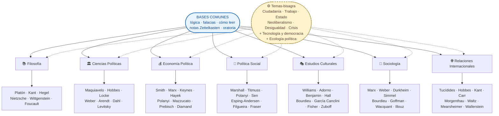

# Itinerarios — Pensamiento Político, Social y Económico

  ¿Qué es esto?
  Un sitio de <strong>autoestudio adulto</strong> en pensamiento sociopolítico, económico, filosófico y cultural. 7 ramas / disciplinas dialogando sobre un mismo corpus de ~70 autores. No es un curso de videos — es un sistema con lectura, escritura, IA con guardrails y producción propia.

  Primera vez
  <a href="como-se-aprende/" class="g-btn g-btn-primary hero-cta-link">Cómo se aprende acá →</a>
  <a href="ramas/" class="g-btn hero-cta-link">Ver las 7 ramas →</a>
  <a href="empieza-aqui/" class="g-btn hero-cta-link">Setup notas + Día 1 →</a>

---

## :material-graph-outline: Mapa del conocimiento

> Clic en cualquier rama del mapa para entrar. ¿Querés recorrer todo en orden con cruces deliberados? → [Plan integrado](plan/maestro.md) (27-29 meses + Ciclo III opcional).

---

<section class="g-section">
  Las 7 ramas
  

    <section class="g-card">
      <strong><a href="ramas/filosofia/">📚 Filosofía</a></strong>
      
Aristóteles · Kant · Hegel · Nietzsche · Wittgenstein · Foucault. 22-24 meses · sistemas de pensamiento

    </section>
    <section class="g-card">
      <strong><a href="ramas/ciencias-politicas/">🏛 Ciencias Políticas</a></strong>
      
Weber · Arendt · Tilly · Dahl · Linz · Levitsky. 18-22 meses · Estado, regímenes, RR.II.

    </section>
    <section class="g-card">
      <strong><a href="ramas/economia/">💰 Economía Política</a></strong>
      
Smith · Marx · Keynes · Hayek · Prebisch · Diamand · Shaikh. 14-18 meses · 3 niveles hasta publicar

    </section>
    <section class="g-card">
      <strong><a href="ramas/politica-social/">🤝 Política Social</a></strong>
      
Marshall · Esping-Andersen · Polanyi · Sen · Filgueira · Fraser. 6-8 meses · welfare + AUH + crítica

    </section>
    <section class="g-card">
      <strong><a href="ramas/estudios-culturales/">🎭 Estudios Culturales</a></strong>
      
Williams · Bourdieu · Hall · García Canclini · Fisher · Zuboff. 6 meses · hegemonía + plataformas

    </section>
    <section class="g-card">
      <strong><a href="ramas/sociologia/">👥 Sociología</a></strong>
      
Marx · Weber · Durkheim · Bourdieu · Goffman · Wacquant · Illouz. 6-8 meses · orden social

    </section>
    <section class="g-card">
      <strong><a href="ramas/relaciones-internacionales/">🌐 Relaciones Internacionales</a></strong>
      
Tucídides · Morgenthau · Waltz · Mearsheimer · Wallerstein · Mbembe. 6 meses · geopolítica + sistema mundial

    </section>
    <section class="g-card">
      <strong><a href="plan/maestro/">📖 Plan integrado</a></strong>
      
Las 7 ramas cruzándose deliberadamente · 5 fases + Ciclo III opcional. 27-36 meses · ruta completa

    </section>
  

</section>

---

  <section class="g-card">
    Fecha · Hora
    
—

    
—:—:—

    
Configura tu inicio ↓

  </section>

  <section class="g-card">
    Fase · Progreso
    
Fase actual—

    
Mes del plan—

    
Semana global—

    

  </section>

  <section class="g-card">
    Tiempo de Estudio
    
Hoy0.0 h

    
Esta semana0.0 h

    
Total0.0 h

    

      <button class="g-btn" data-add="15">+15m</button>
      <button class="g-btn" data-add="30">+30m</button>
      <button class="g-btn" data-add="60">+1h</button>
      <button class="g-btn" data-add="-15" title="Restar">−15m</button>
    

  </section>

  <section class="g-card">
    Racha
    
0

    
Días seguidos

    
Récord —

  </section>

<section class="g-section">
  Configuración Inicial
  

    <label for="start-date-input" style="font-size: 0.78rem;">Empecé / voy a empezar el</label>
    <input type="date" id="start-date-input" class="g-input">
    <button class="g-btn g-btn-primary" id="start-date-save">Guardar</button>
    
  

</section>

  <section class="g-card">
    Atajos
    <ul class="g-links">
      <li><a href="como-se-aprende/">Cómo se aprende acá</a>Ciclo semanal + 5 prompts IA</li>
      <li><a href="ramas/">Las 7 ramas</a>Elegir una puerta</li>
      <li><a href="empieza-aqui/">Empieza aquí</a>Setup notas + Día 1</li>
      <li><a href="plan/maestro/">Plan integrado (maestro)</a>Corpus completo · 5 fases · Ciclo III</li>
      <li><a href="plan/temas-bisagra/">Temas-bisagra</a>Cruces entre las 7 ramas</li>
      <li><a href="plan/ejecutar/">Cómo ejecutar</a>Cadencia + Bloom</li>
      <li><a href="seguimiento/">Mi progreso</a>Checklist + hitos</li>
      <li><a href="plan/falacias/">Manual de falacias</a>Detectar, registrar</li>
      <li><a href="lecturas/">Mis lecturas</a>Una nota por libro</li>
      <li><a href="plantillas/plantilla-falacia/">Capturar falacia</a>Formulario rápido</li>
    </ul>
  </section>

  <section class="g-card">
    Esta Semana
    

      
Configura tu fecha de inicio arriba para ver qué te toca.

    

  </section>

<section class="g-section">
  Mantra del Plan
  <blockquote class="g-mantra">
    Constancia &gt; intensidad. Cuatro horas bien distribuidas a la semana, durante 24 meses, te llevan más lejos que sprints heroicos seguidos de meses muertos. Si una semana no puedes con todo, mantén el ritual diario de 10 min y suspende lo demás.
  </blockquote>
</section>
