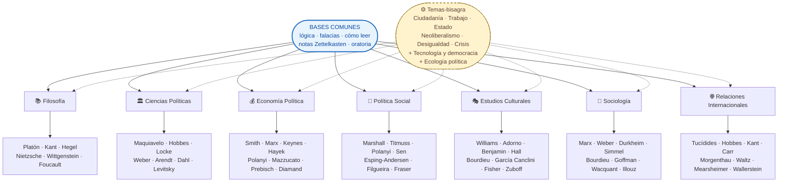

# Mapa del corpus

> Las 7 ramas + bases comunes + temas-bisagra que cruzan disciplinas. Clic en cualquier nodo para entrar.

---

## Cómo leer este mapa

- **Centro:** las **bases comunes** que toda rama necesita — lógica, cómo leer, falacias, sistema de notas, oratoria. Esto NO es opcional para ninguna ruta.
- **Ramas (7):** las disciplinas mayores. Cada una es una "puerta" al mismo corpus, con énfasis distinto. Compartimentos en la apariencia, pero los autores y debates se cruzan adentro.
- **Temas-bisagra (línea punteada):** problemas que cruzan **todas** las ramas. "Desigualdad" es a la vez dato económico, problema político, naturalización cultural. Por eso aparecen como nodo aparte conectado con todas las ramas.

---

## Otras vistas del corpus

- **[Ruta esencial — 12 libros, 6 meses](ruta-esencial.md)** — la versión mínima.
- **[Plan integrado completo](plan/maestro.md)** — 27-36 meses, todo el corpus cruzado deliberadamente.
- **[Las 7 ramas](ramas/index.md)** — overview con criterio para elegir.
- **[Canon ampliado](plan/canon-ampliado.md)** — 45 autores extra investigados en universidades top (Harvard, Oxford, LSE, UBA, UNAM, etc.).

[:material-arrow-left: Volver al inicio](index.md){ .md-button }
